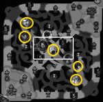

# Upkeep Scripts 2.0

The upkeep scripts are undergoing an overhaul, as they are changed the instructions will be added here. The old scripts will become deprecated

## ChampionTrackImage.py

This script is for isolating champion portraits from the minimap and adding them to the `champs` database, to allow for tracking their positions during the game. The usage is simple enough, simply type `$ python championtrackimage.py` and follow the on-screen instructions

First you must find a frame at which the champion portrait is isolated on the minimap. Just like the highlighted champions here:

Then you must give the name of the champ and the 4 coordinates that result in a 14x14px image of the champion. This is best done through trial-and-error and multiple iterations until the perfect match is found

|Argument|Addition|Explanation
|---|---|---|
|-v|Videos|Call to use local videos instead of YouTube|
|-n|Videos to skip| Number of videos to skip in the playlist| 
|-p|Playlist|YouTube playlist URL|